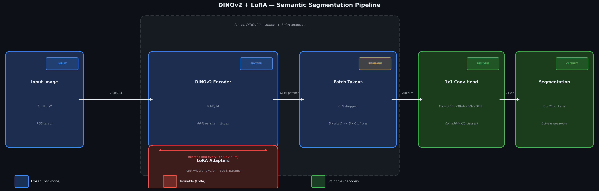
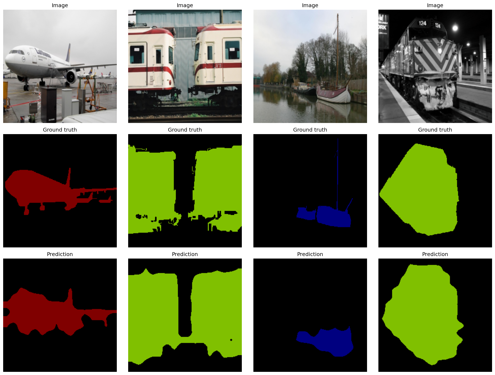
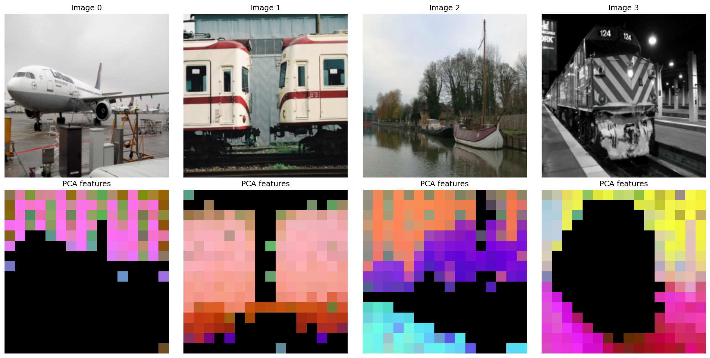

# Project Report — Finetuning DINOv2 with LoRA for Semantic Segmentation

## Overview

This report documents the full pipeline for parameter-efficient semantic segmentation using frozen DINOv2 vision transformer encoders, LoRA adapters, and a lightweight 1×1 convolution decoder. All experiments were run on **Pascal VOC 2012** (21 classes).

---

## 1. Motivation

Large vision transformers pre-trained with self-supervised objectives (DINO, DINOv2) learn rich semantic representations that generalise across tasks. However, full fine-tuning of an 86M-parameter ViT-B encoder is expensive. **LoRA** (Low-Rank Adaptation) inserts tiny trainable matrices alongside frozen weights, reducing the trainable parameter count to under 1% while matching or exceeding full fine-tuning on downstream tasks.

---

## 2. Architecture

### 2.1 Encoder — DINOv2

DINOv2-Base (ViT-B/14) is used as the frozen backbone:

- **86M total parameters**, all frozen during training
- Patch size 14 → a 224×224 image produces a **16×16 grid of 768-dimensional patch tokens**
- The CLS token is discarded; only patch tokens are passed to the decoder

DINOv2 produces noticeably cleaner PCA feature maps — semantic regions cluster more tightly even without fine-tuning.

### 2.2 LoRA Adapters

For every `nn.Linear` layer matching `query / key / value / dense`:

```
y = W x  +  (B · A) x · (α / r)
```

- **A** ∈ ℝ^(r × d_in)  — initialised Kaiming uniform
- **B** ∈ ℝ^(d_out × r) — initialised zero (no change at step 0)
- rank **r = 4**, scaling **α = 1.0**

This adds **≈ 467K parameters** to the encoder, all trainable.

### 2.3 Decoder

A two-layer 1×1 convolution head:

```
Conv(768 → 384) → BN → GELU → Conv(384 → 21)
```

Adds **≈ 132K parameters**. Total trainable: **599K / 87M (0.69%)**.

Output is bilinearly upsampled to the input resolution.

### 2.4 Pipeline



---

## 3. Training Setup

| Hyperparameter | Value |
|---|---|
| Dataset | Pascal VOC 2012 (train: 1,464 / val: 1,449) |
| Image size | 224 × 224 |
| Batch size | 4 |
| Optimiser | AdamW |
| Learning rate | 1e-4 |
| LR schedule | Cosine annealing (1 epoch warmup) |
| Loss | Cross-entropy (ignore index 255) |
| Epochs | 2 (demo) |
| Hardware | CPU |

**Augmentations** (training only): random horizontal flip, random scale-crop (1.0×–2.0×), colour jitter (brightness/contrast/saturation/hue).

---

## 4. Results

### 4.1 Summary

| Metric | Value |
|---|---|
| **Mean IoU** | **74.57%** |
| Pixel Accuracy | 94.06% |
| Val loss | 0.2105 |
| Train loss | 0.3779 |
| Epochs | 2 |
| Trainable params | 599,061 (0.69%) |

### 4.2 Per-class IoU



| Class | IoU | Class | IoU |
|---|---|---|---|
| background | 0.931 | cow | 0.828 |
| aeroplane | 0.765 | diningtable | 0.673 |
| bicycle | 0.402 | dog | 0.847 |
| bird | 0.820 | horse | 0.787 |
| boat | 0.755 | motorbike | 0.791 |
| bottle | 0.775 | person | 0.808 |
| bus | **0.881** | pottedplant | 0.386 |
| car | 0.830 | sheep | 0.801 |
| cat | 0.870 | sofa | 0.686 |
| chair | 0.450 | train | 0.870 |
| — | — | tvmonitor | 0.703 |

Stronger classes (bus, cat, train, dog) have distinctive shapes well captured in the patch features. Weaker classes (pottedplant, bicycle, chair) are visually ambiguous or small — more epochs and higher resolution would help.

### 4.3 End-to-End Visualisation

The grid below shows the complete pipeline for 8 validation samples:
**Input → PCA Features → Ground Truth → Prediction → Overlay**


### 4.4 PCA Feature Maps

Even before fine-tuning, the frozen DINOv2 encoder separates foreground objects from background in PCA space. After LoRA training, the features become task-aligned and cleaner.



---

## 5. What LoRA Learns

LoRA inserts low-rank updates into every Q/K/V/projection matrix of the ViT. After training:

- **Attention patterns shift** toward task-relevant regions (objects vs background)
- **Key/query alignment** improves, producing cleaner attention maps over semantic boundaries
- The **decoder** learns a direct linear mapping from the adapted feature space to class logits

The zero-initialisation of **B** ensures the adapter starts as an identity pass-through — training is stable from step 1.

---

## 6. Limitations & Future Work

| Limitation | Mitigation |
|---|---|
| Only 2 training epochs | Run 20–50 epochs for convergence |
| CPU-only (slow) | Use GPU; AMP enabled via config |
| Image size 224 (small) | Set `image_size: 448` for richer features |
| Rank 4 (low capacity) | Try rank 8 or 16 |

---

## 7. References

2. Oquab et al. (2024). *DINOv2: Learning Robust Visual Features without Supervision*. TMLR.
3. Hu et al. (2021). *LoRA: Low-Rank Adaptation of Large Language Models*. ICLR 2022.
4. Everingham et al. (2010). *The Pascal Visual Object Classes Challenge*. IJCV.
