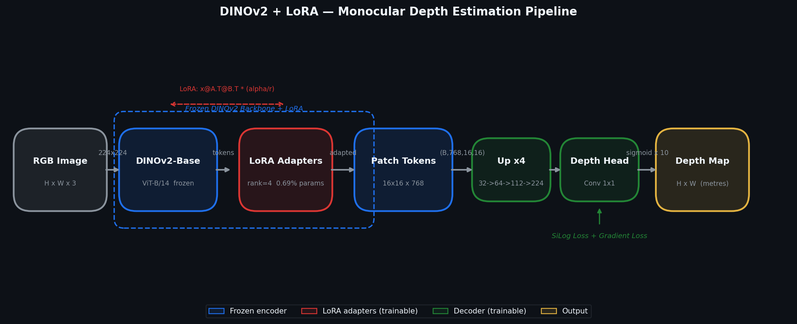

# DINOv2 + LoRA — Monocular Depth Estimation

[](https://www.python.org/)
[](https://pytorch.org/)
[](../LICENSE)

A second project in this repository: monocular depth estimation from a single RGB image using a **frozen DINOv2-Base backbone with LoRA adapters** and a lightweight progressive-upsampling decoder. Trained on **NYU Depth v2** (indoor scenes, max ~10 m).

---

## Pipeline



The frozen ViT-B/14 encoder extracts patch tokens (16×16 grid at 768-dim). LoRA adapters (rank=4) inject task-specific knowledge into Q/K/V/dense projections, updating only **0.69% of parameters**. The decoder progressively doubles spatial resolution across four stages until reaching full image size, outputting a single-channel depth map in metres.

---

## Architecture

```
RGB Image (224x224)
       |
  [DINOv2-Base ViT-B/14] — FROZEN
       | LoRA adapters in every Q/K/V/dense  (rank=4, alpha=1)
       |
  Patch tokens  (B, 768, 16, 16)
       |
  DepthDecoder
    up1: 16x16 -> 32x32   Conv-BN-GELU x2  (768->256)
    up2: 32x32 -> 64x64   Conv-BN-GELU x2  (256->128)
    up3: 64x64 -> 112x112 Conv-BN-GELU x2  (128->64)
    up4: 112   -> 224x224 Conv-BN-GELU x2  (64->32)
    head: Conv 1x1 -> sigmoid * max_depth
       |
  Depth Map (B, 1, 224, 224)  in metres
```

**Loss** = `SiLog(pred, gt) + 0.5 * GradientLoss(pred, gt)`

- **SiLog**: `sqrt(mean(d²) - 0.85 * mean(d)²)`, where `d = log(pred) - log(gt)` — scale-invariant
- **GradientLoss**: penalises blurry depth boundaries via log-depth spatial gradients

| Parameter group | Count |
|---|---|
| DINOv2-Base (frozen) | ~86.4M |
| LoRA adapters | ~294K |
| Decoder | ~305K |
| **Trainable total** | **~599K (0.69%)** |

---

## Dataset: NYU Depth v2

Indoor RGB-D dataset captured with a Microsoft Kinect. 1449 labelled pairs at 480×640, max depth ~10 m.

Download the preprocessed HDF5 file (~2.8 GB):

```
https://drive.google.com/file/d/1WoOZOBpOWfmwe7bknWS5PMUCLBPFKTbd
```

Place it at `../data/nyu_depth_v2.h5` (relative to the `depth/` directory), or update `data.h5_path` in `configs/default.yaml`.

---

## Quick Start

```bash
# from the repo root
cd depth

# train (CPU — slow; set amp: true for CUDA)
python train.py

# evaluate a checkpoint
python evaluate.py --checkpoint checkpoints/depth_best.pt

# predict on a single image
python predict.py --image path/to/photo.jpg --checkpoint checkpoints/depth_best.pt
```

---

## Configuration

All hyperparameters live in `configs/default.yaml`:

| Key | Default | Description |
|---|---|---|
| `encoder.name` | `facebook/dinov2-base` | HuggingFace model ID |
| `lora.rank` | `4` | LoRA rank |
| `lora.alpha` | `1.0` | LoRA scaling factor |
| `depth.max_depth` | `10.0` | Clamp depth output (metres) |
| `data.image_size` | `224` | Input resolution |
| `training.epochs` | `20` | Number of epochs |
| `training.lr` | `5e-5` | Peak learning rate |
| `training.silog_weight` | `1.0` | SiLog loss weight |
| `training.grad_weight` | `0.5` | Gradient loss weight |
| `training.amp` | `false` | Mixed precision (CUDA only) |

---

## Metrics

| Metric | Description | Direction |
|---|---|---|
| **AbsRel** | Mean absolute relative error | lower is better |
| **RMSE** | Root mean squared error (metres) | lower is better |
| **delta < 1.25** | % pixels within 25% of GT | higher is better |
| **delta < 1.25²** | % pixels within 56% of GT | higher is better |
| **delta < 1.25³** | % pixels within 95% of GT | higher is better |

---

## Project Structure

```
depth/
├── src/
│   ├── model.py        # DepthEstimator (DINOv2 + LoRA + DepthDecoder)
│   ├── dataset.py      # NYUDepthDataset + DepthTransform
│   └── utils.py        # SiLogLoss, GradientLoss, DepthMetrics, colorize_depth
├── configs/
│   └── default.yaml    # All hyperparameters
├── assets/
│   └── pipeline.png    # Architecture diagram
├── train.py            # Training loop (tqdm + AMP + cosine LR + checkpointing)
├── evaluate.py         # Evaluation with per depth-range breakdown
├── predict.py          # Single-image or folder inference
└── gen_pipeline.py     # Script to regenerate the pipeline diagram
```

---

## Tips for Better Results

| Change | Expected gain |
|---|---|
| GPU training (`amp: true`) | 10–15× faster, same accuracy |
| `lora.rank: 8` or `16` | Better boundary sharpness |
| `image_size: 384` | Finer spatial resolution |
| More epochs (30–50) | Lower AbsRel |

---

## References

- Oquab et al. (2024) — *DINOv2: Learning Robust Visual Features without Supervision*
- Hu et al. (2021) — *LoRA: Low-Rank Adaptation of Large Language Models*
- Eigen et al. (2014) — *Depth Map Prediction from a Single Image using a Multi-Scale Deep Network*
- Silberman et al. (2012) — *Indoor Segmentation and Support Inference from RGBD Images (NYU Depth v2)*
